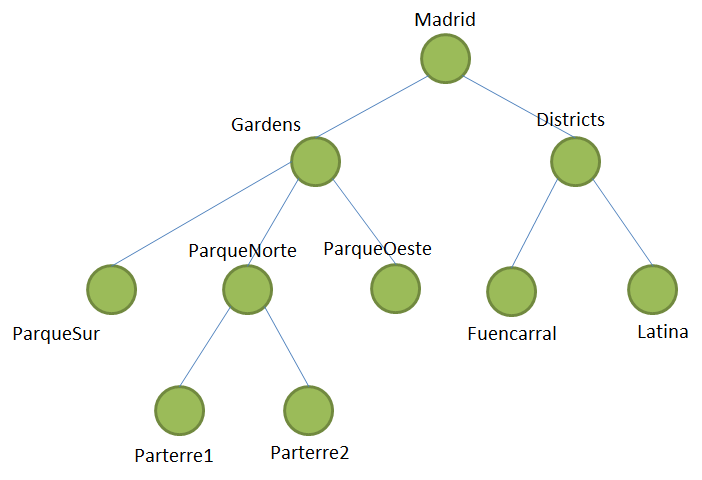

# サービスパス

## エンティティ・サービスパス

Orion Context Broker は階層スコープをサポートしているため、[updateContext](walkthrough_apiv1.md#update-context-elements) (または [関連するコンビニエンス・オペレーション](walkthrough_apiv1.md#convenience-update-context)) を使用して、作成時にエンティティをスコープに割り当てることができます。次に、[queryContext](walkthrough_apiv1.md#query-context-operation)および [subscribeContext](walkthrough_apiv1.md#context-subscriptions) (および関連するコンビニエンス・オペレーション) も、対応するスコープのエンティティを見つけるためにスコープ指定することができます。

たとえば、次のスコープ (図に示す) を使用する Orion ベースのアプリケーションを考えてみましょう :

-   Madrid (マドリード) : 第1レベルのスコープとして
-   Gardens と Districts (庭園と地区) : 第2レベルのスコープ (マドリッドの子供)として
-   ParqueNorte と ParqueOeste, ParqueSur (庭園の子供)、Fuencarra と Latina (地区の子供)
-   Parterre1 と Parterre2 (ParqueNorte の子供)

使用するスコープは、アップデート/クエリのリクエストの "Fiware-ServicePath" HTTP を使用して指定します。たとえば、"Parterre1" に "Tree" という型のエンティティ "Tree1" を作成するには、次のような Fiware-ServicePath が使用されます :

    Fiware-ServicePath: /Madrid/Gardens/ParqueNorte/Parterre1

そのスコープで "Tree1" を検索するには、同じ Fiware-ServicePath が使用されます。

スコープは階層的であり、階層的な検索を行うことができます。そのために、'＃' 特殊キーワードが使用されています。したがって、`/Madrid/Gardens/ParqueNorte/#` の中に "Tree" 型のエンティティ ID ".\*" のパターンを持つ queryContext は、ParqueNorte、Parterre1 および Parterre2 のすべてのツリーを返します。

最後に、Fiware-ServicePath ヘッダでコンマ区切りのリストを使用して、不均等なスコープをクエリすることができます。たとえば、ParqueNorte と ParqueOeste (ParqueSur ではなく) のツリーをすべて取得するには、queryContext リクエストで次の Fiware-ServicePath を使用します :

    Fiware-ServicePath: /Madrid/Gardens/ParqueNorte, /Madrid/Gardens/ParqueOeste

いくつかの追加意見 :

-   制限事項 :
    -   スコープは "/" で始まる必要があります ("絶対" スコープのみが許可されます)
    -   パス内の最大スコープレベルは10です。
    -   各レベルで最大50文字 (1文字は最小)、英数字とアンダースコアのみ許可
    -   Fiware-ServicePath ヘッダのコンマ区切りリスト内の最大10個の独立したスコープパス (Fiware-ServicePath ヘッダの更新で1つ以上のスコープパス)
    -   末尾のスラッシュは削除されます。

-   Fiware-ServicePath はオプションのヘッダです。Fiware-ServicePath なしで (またはデータベース内のサービスパス情報を含まない) 作成されたすべてのエンティティは、暗黙的にルートスコープ "/" に属しているとみなされます。Fiware-ServicePath (サブスクリプションを含む) を使用しないすべてのクエリは暗黙的に "/＃" にあります。この動作により、0.14.0 より前のバージョンとの下位互換性が保証されます

-   異なるスコープで同じ ID と型のエンティティを持つことは可能です。例えば、/Madrid/Gardens/ParqueNorte/Parterre1 に型 "Tree" のエンティティ ID "Tree1" を作成し、/Madrid/Gardens/ParqueOeste に "Tree" 型の ID "Tree1" を持つ別のエンティティを作成することができます。ただし、このシナリオでは queryContext が奇妙になることがあります (例えば Fiware-ServicePath/Madrid/Gardens の queryContext は、同じ ID と型の2つのエンティティを queryContextResponse に返します。これにより、どのスコープがそれぞれのスコープに属しているかを区別しにくくなります)

-   エンティティは1つのスコープ (そして、1つだけ) に属します

-   Orion によって送信された NGSI10 notifyContext リクエストには、Fiware-ServicePath ヘッダが含まれています

-   スコープエンティティは、[マルチサービス/マルチテナント機能](multitenancy.md#multi-service-tenancy)と直交して組み合わせることができます。その場合、各 "scope tree (スコープ・ツリー)" は異なるサービス/テナントに存在し、完全なデータベースベースの分離で同じ名前を使用することもできます。下の図を参照してください

-   現在のバージョンでは、API を使用してエンティティが属するスコープを変更することはできません (エンティティコレクションの _id.servicePath フィールドを直接修正することで回避できます)

## サブスクリプションとレジストレーションでのサービスパス

エンティティはサービスとサービスパスに属しますが、サブスクリプションとレジストレーションはそのサービスに *のみ* 属します。サブスクリプションとレジストレーションの servicepath は所属を表すのではなく、サブスクリプションまたはレジストレーションに関連付けられたクエリの表現です。

これを考慮して、以下の規則が適用されます :

* id は検索するサブスクリプションまたはレジストレーションを完全に修飾するため、Fiware-ServicePath ヘッダは `GET/v2/subscriptions/{id}` および `GET/v2/registrations/{id}` オペレーションでは無視されます
* そのサービスパスをクエリとして正確に使用するサブスクリプション/レジストレーションに結果を絞り込むために、`GET/v2/subscriptions` と `GET/v2/registrations` で Fiware-ServicePath ヘッダが考慮されます
* 現時点では、階層サービスパス (すなわち、# で終わるもの) はレジストレーションでは許可されていません。[Github にそれに関する問題](https://github.com/telefonicaid/fiware-orion/issues/3078)があり、制限が最終的に解決される可能性があります
