# <a name="top"></a>mongoBackend library

* [Introduction](#introduction)
* [Request processing modules](#request-processing-modules)
	* [`mongoUpdateContext` (SR) and `mongoNotifyContext` (SR)](#mongoupdatecontext-sr-and-mongonotifycontext-sr)
	* [`mongoQueryContext` (SR)](#mongoquerycontext-sr)
	* [`mongoQueryTypes` (SR and SR2)](#mongoquerytypes-sr-and-sr2)
	* [`mongoCreateSubscription` (SR2)](#mongocreatesubscription-sr2)
	* [`mongoUpdateSubscription` (SR2)](#mongoupdatesubscription-sr2)
	* [`mongoGetSubscriptions` (SR2)](#mongogetsubscriptions-sr2)
	* [`mongoUnsubscribeContext` (SR and SR2)](#mongounsubscribecontext-sr-and-sr2)
	* [`mongoSubscribeContext` (SR)](#mongosubscribecontext-sr)
	* [`mongoUpdateContextSubscription` (SR)](#mongoupdatecontextsubscription-sr)
	* [`mongoRegisterContext` (SR) and `mongoNotifyContextAvailability` (SR)](#mongoregistercontext-sr-and-mongonotifycontextavailability-sr)
	* [`mongoDiscoverContextAvailability` (SR)](#mongodiscovercontextavailability-sr)
	* [`mongoSubscribeContextAvailability` (SR)](#mongosubscribecontextavailability-sr)
	* [`mongoUpdateContextAvailabilitySubscription` (SR)](#mongoupdatecontextavailabilitysubscription-sr)
	* [`mongoUnsubscribeContextAvailability` (SR)](#mongounsubscribecontextavailability-sr)
	* [`mongoRegistrationGet` (SR2)](#mongoregistrationget-sr2)
	* [`mongoRegistrationCreate` (SR2)](#mongoregistrationcreate-sr2) 
* [Connection pool management](#connection-pool-management)
* [Low-level modules related to DB interaction](#low-level-modules-related-to-db-interaction)
* [Specific purpose modules](#specific-purpose-modules)
* [The `MongoGlobal` module](#the-mongoglobal-module)
	* [`mongoInit()`](#mongoinit)
	* [`entitiesQuery()`](#entitiesquery)
	* [`registrationsQuery()`](#registrationsquery) 
	* [`processConditionVector()`](#processconditionvector)
	* [`processAvailabilitySubscription()`](#processavailabilitysubscription)

## Introduction

The **mongoBackend** library is where all the database interaction takes place. More than that, it is where most of the actual processing for the different operations exposed by Orion Context Broker takes place. In some sense it is like the "brain" of Orion.

The entry points of this library are:

* From [serviceRoutines](sourceCode.md#srclibserviceroutines) and [serviceRoutinesV2](sourceCode.md#srclibserviceroutinesv2). Those are the most important entry points.
* Other entry points from other places as initialization routines and helpers methods.

This library makes an extensive use of [MongoDB C++ driver](http://mongodb.github.io/mongo-cxx-driver/), for sending operations to database and dealing with BSON data (which is the basic structure datatype used by these operations). You should be familiar with this driver in order to understand how the library works.

This library is also related to the [cache](sourceCode.md#srclibcache) library (if subscription cache is enabled, i.e. the global `noCache` bool variable is set to `false`), in two different ways: 

* context creation/modificacion/removal modules modifying the subscription cache content
* entity creation/update logic checking the subscription cache in order to look for triggering subscriptions

Note that the subscription cache only applies to *context* subscriptions. The *context availability subscriptions* don't use any cache at all. 

The different modules included in this library are analyzed in the following sections.

[Top](#top)

### Request processing modules

These modules implement the different Context Broker requests. They are called during the overall request processing flow by service routine libraries (either the **serviceRoutines** or the **serviceRoutinesV2** libraries). Nextcoming subsections describe each module (SR means the module is called from **serviceRoutines** and SR2 means the module is called from  **serviceRoutineV2**; note that no module is called from *both* libraries).

This section also describes the `MongoCommonRegister` and `MongoCommonUpdate` modules which provide common functionality highly coupled with several other request processing modules. In particular:

* `MongoCommonRegister` provides common functionality for the `mongoRegisterContext` and `mongoNotifyContextAvailability` modules.
* `MongoCommonUpdate` provides common functionality for the `mongoUpdateContext` and `mongoNotifyContext` modules.

[Top](#top)

#### `mongoUpdateContext` (SR) and `mongoNotifyContext` (SR)

The `mongoUpdateContext` module provides the entry point for the update context operation processing logic (by means of `mongoUpdateContext()` defined in its header file `lib/mongoBackend/mongoUpdateContext.h`) while the `mongoNotifyContext` module provides the entry point for the context notification processing logic (by means of `mongoNotifyContext()` defined in its header file `lib/mongoBackend/mongoNotifyContext.h`). However, given that a context  notification is processed in the same way as an update context of "APPEND" action type, both `mongoUpdateContext()` and `mongoNotifyContext()` are in the end basically wrapper functions for `processContextElement()` (single external function in the `MongoCommonUpdate` module), which does the real work.

The execution flow in this module depends on a few conditions which, for the sake of clarity, are describe based on five different subcases:

* Case 1: action type is "UPDATE" or "REPLACE" and the entity is found.
* Case 2: action type is "UPDATE" or "REPLACE" and the entity is not found.
* Case 3: action type is "APPEND" or "APPEND_STRICT" and the entity is found.
* Case 4: action type is "APPEND" or "APPEND_STRICT" and the entity is not found.
* Case 5: action type is "DELETE" to partially delete some attributes of an entity.
* Case 6: action type is "DELETE" to remove an entity.

Note that `mongoUpdateContext()` applies to all 6 cases, while `mongoNotifyContext()` only applies to cases 3 and 4.

Case 1: action type is "UPDATE" or "REPLACE" and the entity is found.

<a name="flow-mb-01"></a>


_MB-01: mongoUpdate UPDATE/REPLACE case with entity found_  

* `mongoUpdateContext()` is invoked from a service routine (step 1).
* Depending on `-reqMutexPolicy`, the request semaphore may be taken (write mode) (step 2). See [this document for details](semaphores.md#mongo-request-semaphore).
* In a loop, `processContextElement()` is called for each `ContextElement` object (CE, in short) of the incoming request (step 3).
* After pre-conditions checks, `processContextElement()` processes an individual CE. First, the entity corresponding to that CE is searched in the database, using `collectionQuery()` in the `connectionOperations` module (steps 4 and 5). Let's assume that the entity is found (step 6).
* The execution flow passes to `updateEntity()`, in charge of doing the entity update (step 7). `updateEntity()` in sequence passes the flow to `processContextAttributeVector()` in order to process the attributes in the CE (step 8).
* `processContextAttributeVector()` contains a loop calling `updateContextAttributeItem()` for processing of each individual attribute in the CE (step 9). Details on the strategy used to implement this processing later.
* Once the processing of the attributes in done, `processContextAttributesVector()` calls `addTriggeredSubscriptions()` to detect subscriptions triggered by the update operation (step 10). More details on this later.
* Finally the control is returned to `updateEntity()` with invokes `collectionUpdate()` in the `connectionOperations` module in order to actually update the entity in the database (steps 11 and 12).
* The next step is to send the notifications triggered by the update operation, which is done by `processSubscriptions()` (step 13). More details on this in (diagram [MD-01](#flow-md-01)).
* Finally, `searchContextProviders()` is called to try to find a suitable context provider for each attribute in the CE that was not found in the database (step 14). This information would be used by the calling service routine in order to forward the update operation to context providers, as described in the [context providers documentation](cprs.md). More information on `searchContextProviders()` in (diagram [MD-02](#flow-md-02)).
* If the request semaphore was taken in step 2, then it is released before returning (step 15).

Case 2: action type is "UPDATE" or "REPLACE" and the entity is not found.

<a name="flow-mb-02"></a>


_MB-02: mongoUpdate UPDATE/REPLACE case with entity not found_

* `mongoUpdateContext()` is invoked from a service routine (step 1).
* Depending on `-reqMutexPolicy`, request semaphore may be taken (write mode) (step 2). See [this document for details](semaphores.md#mongo-request-semaphore).
* In a loop, `processContextElement()` is called for each `ContextElement` object (CE, in short) of the incoming request (step 3).
* After precondition checks, `processContextElement()` processes an individual CE. First, the entity corresponding to that CE is searched in the database, using `collectionQuery()` in the `connectionOperations` module (steps 4 and 5). Let's assume that the entity is not found (step 6).
* `searchContextProviders()` is called in order to try to find a suitable context provider for the entity (step 7). This information would be used by the calling service routine to forward the update operation to context providers, as described in the [context providers documentation](cprs.md). More information on `searchContextProviders()` implementation in (diagram [MD-02](#flow-md-02)).
* If the request semaphore was taken in step 2, then it is released before returning (step 8).

Case 3: action type is "APPEND" or "APPEND_STRICT" and the entity is found.

<a name="flow-mb-03"></a>
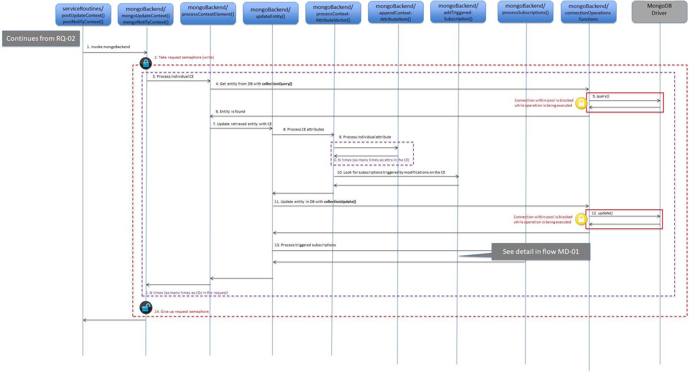

_MB-03: mongoUpdate APPEND/APPEND_STRICT case with existing entity_

* `mongoUpdateContext()` or `mongoNotifyContext()` is invoked from a service routine (step 1).
* Depending on `-reqMutexPolicy`, the request semaphore may be taken (write mode) (step 2). See [this document for details](semaphores.md#mongo-request-semaphore).
* In a loop, `processContextElement()` is called for each `ContextElement` object (CE, in short) of the incoming request (step 3).
* After precondition checks, `processContextElement()` processes an individual CE. First, the entity corresponding to that CE is searched in the database, using `collectionQuery()` in the `connectionOperations` module (steps 4 and 5). Let's assume that the entity is found (step 6).
* The execution flow passes to `updateEntity()` that is in charge of doing the entity update (step 7). `updateEntity()` in its turn passes the flow to `processContextAttributeVector()` in order to process the attributes in the CE (step 8).
* `processContextAttributeVector()` calls `appendContextAttributeItem()` in a loop to process each individual attribute in the CE (step 9). More details regarding the strategy used to implement this processing later.
* Once the processing of the attributes is done, `processContextAttributesVector()` calls `addTriggeredSubscriptions()` to detect subscriptions triggered by the update operation (step 10). More details on this later.

* When the control is returned to `updateEntity()`, `collectionUpdate()` in the `connectionOperations` module is invoked to actually update the entity in the database (steps 11 and 12).
* The next step is to send the notifications triggered by the update operation, which is done by `processSubscriptions()` (step 13). More details on this in (diagram [MD-01](#flow-md-01)).
* The current version of Orion (as of May 2017) calls `searchContextProviders()`, like in **Case 1**. This shouldn't be done in the "APPEND"/"APPEND_STRICT" cases, as these types of requests are always processed locally and should **not** be forwarded to context providers. The fix is pending (see [this issue](https://github.com/telefonicaid/fiware-orion/issues/2874)).
* If the request semaphore was taken in step 2, then it is released before returning (step 14).

Case 4: action type is "APPEND" or "APPEND_STRICT" and the entity is not found.

<a name="flow-mb-04"></a>


_MB-04: mongoUpdate APPEND/APPEND_STRICT case with new entity_

* `mongoUpdateContext()` or `mongoNotifyContext()` is invoked from a service routine (step 1).
* Depending on `-reqMutexPolicy`, the request semaphore may be taken (write mode) (step 2). See [this document for details](semaphores.md#mongo-request-semaphore).
* In a loop, `processContextElement()` is called for each `ContextElement` object (CE, in short) of the incoming request (step 3).
* After precondition checks, `processContextElement()` processes an individual CE. First, the entity corresponding to that CE is searched in the database, using `collectionQuery()` in the `connectionOperations` module (steps 4 and 5). Let's assume that the entity is not found (step 6).
* The execution flow passes to `createEntity()` that in charge of creating the entity (step 7). The actual creation of the entity in the database is done by `collectionInsert()` in the `connectionOperations` module (steps 8 and 9).
* Control is returned to `processContextElement()`, which calls `addTriggeredSubscriptions()` in order to detect subscriptions triggered by the update operation (step 10). More details on this later.
* The next step is to send notifications triggered by the update operation, by calling `processSubscriptions()` (step 11). More details on this in (diagram [MD-01](#flow-md-01)).
* If the request semaphore was taken in step 2, then it is released before returning (step 12). 

Case 5: action type is "DELETE" to partially delete some attributes of an entity.

<a name="flow-mb-05"></a>


_MB-05: mongoUpdate DELETE not remove entity_

* `mongoUpdateContext()` is invoked from a service routine (step 1).
* Depending on `-reqMutexPolicy`, the request semaphore may be taken (write mode) (step 2). See [this document for details](semaphores.md#mongo-request-semaphore).
* In a loop, `processContextElement()` is invoked for each `ContextElement` object (CE, in short) of the incoming request (step 3).
* After precondition checks, `processContextElement()` processes an individual CE. First, the entity corresponding to that CE is searched in the database, by calling `collectionQuery()` in the `connectionOperations` module (steps 4 and 5). Let's assume that the entity is found (step 6).
* The execution flow passes to `updateEntity()`, thqat is in charge of doing the entity update (step 7). `updateEntity()` in its turn passes the flow to `processContextAttributeVector()` in order to process the attributes of the CE (step 8).
* `processContextAttributeVector()` calls `deleteContextAttributeItem()` in a loop over each individual attribute in the CE (step 9). More details regarding the strategy used to implement this processing later.
* Once the processing of the attributes is done, `processContextAttributesVector()` calls `addTriggeredSubscriptions()` in order to detect subscriptions triggered by the update operation (step 10). More details on this later.
* When the control is returned to `updateEntity()`, `collectionUpdate()` in the `connectionOperations` module is invoked to update the entity in the database (steps 11 and 12).
* The next step is to send notifications triggered by the update operation, by invoking `processSubscriptions()` (step 13). More details on this in (diagram [MD-01](#flow-md-01)).
* The current version of Orion (as of May 2017) calls `searchContextProviders()`, like in **Case 1**. This shouldn't be done in the "DELETE" case, as this type of requests are always processed locally and should **not** be forwarded to context providers. The fix is pending  (see [this issue](https://github.com/telefonicaid/fiware-orion/issues/2874)).
* If the request semaphore was taken in step 2, then it is released before returning (step 14). 

Case 6: action type is "DELETE" to remove an entity

<a name="flow-mb-06"></a>


_MB-06: mongoUpdate DELETE remove entity_

* `mongoUpdateContext()` is invoked from a service routine (step 1).
* Depending on `-reqMutexPolicy`, the request semaphore may be taken (write mode) (step 2). See [this document for details](semaphores.md#mongo-request-semaphore). 
* In a loop, `processContextElement()` is called for each `ContextElement` object (CE, in short) of the incoming request (step 3).
* After precondition checks, `processContextElement()` processes an individual CE. First, the entity corresponding to that CE is searched in the database, by invoking `collectionQuery()` in the `connectionOperations` module (steps 4 and 5). Let's assume that the entity is found (step 6).
* The execution flow passes to `updateEntity()`, in charge of doing the entity update (step 7). `updateEntity()` in its turn passes the flow to `removeEntity()` in order to do the actual entity removal (step 8).
* `removeEntity()` invokes `collectionRemove()` in the `connectionOperations` module in order to actually remove the entity in the database (steps 9 and 10).
* If the request semaphore was taken in step 2, then it is released before returning (step 11).

Next, we are going to describe some implementation aspects that are common to several of the cases described above.

Regarding the strategy used in `processContextAttributeVector()` to implement entity update, this function keeps several variables that hold a "delta" of modifications (to be applied to the entity in the database), in particular: 

* `toSet`: attributes that need to be *added to* or *updated in* the entity `attrs` field in the database, using the [`$set` operator](https://docs.mongodb.com/manual/reference/operator/update/set).
* `toUnset`: attributes that need to be removed from the entity `attrs` field in the database, using the [`$unset` operator](https://docs.mongodb.com/manual/reference/operator/update/unset).
* `toPush`: attributes that need to be added to the entity `attrsName` field in the database (list of attribute names), using the [`$addToSet`](https://docs.mongodb.com/manual/reference/operator/update/addToSet) and [`$each`](https://docs.mongodb.com/manual/reference/operator/update/each) operators.
* `toPull`: attributes that need to be removed from the `attrsName` field in the database (list of attribute names), using the [`$pullAll` operator](https://docs.mongodb.com/manual/reference/operator/update/pullAll).
* `locAttr` and `geoJson` are related to modifications in the geolocation information associated to the entity (entity `location` field in the database).

The update is based on "deltas" rather than setting the whole `attrs` and `attrsName` due to the fact that updates can be done concurrently in the database to the same entity (by different request threads in the same CB process or by different CB processes running in different nodes in active-active configurations) and `attrs/attrsName` set by one thread could ruin `attrs/attrsName` for the other thread.

These variables are returned to `updateEntity()` as output parameters, to be used in the entity update operation on the database (as shown in the diagrams above)

In order to fill `toSet`, `toUnset`, etc. `processContextAttributeVector()` processes the attributes in the incoming CE. Execution for each attribute processing is delegated to a per-attribute processing function:

* `updateContextAttributeItem()`, if action type is UPDATE or REPLACE. `updateAttribute()` is used internally as a helper function (which in its turn may use `mergeAttrInfo()` to merge the attribute information in the database and in the incoming CE).
* `appendContextAttributeItem()`, if action type is APPEND or APPEND_STRICT. `appendAttribute()` is used internally as a helper function, passing the ball to `updateAttribute()` if the attribute already exists in the entity and it isn't an actual append.
* `deleteContextAttributeItem()`, if action type is DELETE. `deleteAttribute()` is used internally as a helper function.

During the update process, either in the case of creating new entities or updating existing ones, context subscriptions may be triggered, so notifications would be sent. In order for this to work, the update logic keeps a map `subsToNotify` to hold triggered subscriptions. `addTriggeredSubscriptions()`  is in charge of adding new subscriptions to the map, while `processSubscriptions()` is in charge of sending the notifications once the process has ended, based on the content of the map `subsToNotify`. Both `addTriggeredSubscriptions()` and `processSubscriptions()` invocations are shown in the context of the different execution flow cases in the diagrams above.

* `addTriggeredSubscriptions()`. Actually, there are two versions of this function (`addTriggeredSubscriptions()` itself is just a dispatcher): the `_withCache()` version (which uses the subscription cache to check whether a particular entity modification triggers any subscriptions) and `_noCache()` (which checks the `csubs` collection in the database in order to do the checking). Obviously, the version to be used depends on whether the subscription cache is enabled or not, i.e. the value of the global `noCache` bool variable. The `_withCache()` version needs to take/give the subscription cache semaphore (see [this document for details](semaphores.md#subscription-cache-semaphore)).
* `processSubscriptions()`. Apart from the `subsToNotify` map, another important parameter in this function is `notifyCerP`, which is a reference to the context element response (CER) that will be used to fill in the notifications to be sent. In the case of new entities, this CER is built from the contents of the incoming CE in the update request. In the case of updating an existing entity, the logic starts with CER and updates it at the same time the `toSet`, `toUnset`, etc. fields are built. In other words, the logic keeps always an updated CER while the CE attributes are being processed. `updateAttrInNotifyCer()` (used in `updateContextAttributeItem()` and `updateContextAttributeItem()`) and `deleteAttrInNotifyCer()` (used in `deleteContextAttributeItem()`) are helper functions used to do this task. Details on this are shown in the sequence diagram below.

<a name="flow-md-01"></a>


_MD-01: `processSubscriptions()` function detail_

* `processSubscriptions()` is invoked (step 1) from a number of places. See diagrams [MB-01](#flow-mb-01), [MB-03](#flow-mb-03), [MB-04](#flow-mb-04) and [MB-05](#flow-mb-05). Each individual triggered subscription is handled in a loop by calling `processOnChangeConditionForUpdateContext()`.
* `processOnChangeConditionForUpdateContext()` is called (step 2), which in its turn uses the `Notifier` object (from [ngsiNotify](sourceCode.md#srclibngsinotify) library) in order to send the notification (step 3). The detail is described in diagrams [NF-01](sourceCode.md#flow-nf-01) and [NF-03](sourceCode.md#flow-nf-03).
* The next steps are done only in case a notification was actually sent. Depending on cache usage:
    * If subscription cache is not being used, then the last notification time and count in the database are updated in the database, using `collectionUpdate()` in the `connectionOperations` module (steps 4 and 5).
    * If subscription cache is being used, then the subscription is retrieved from the subscription cache calling `subCacheItemLookup()` (step 7). Next, last notification time and count are modified in the subscription cache (they will be consolidated in the database in the next subscription cache refresh, see details in [this document](subscriptionCache.md#subscription-cache-refresh)). The access to the subscription cache is protected by the subscription cache semaphore (see [this document for details](semaphores.md#subscription-cache-semaphore)), which is taken and released in steps 6 and 8 respectively.

Finally, in the case of action type "UPDATE/REPLACE", the context update logic is able to "fill the gaps" for missing entities/attributes in the local database with Context Provider information. This is done in `searchContextProviders()`. The detail is shown in the sequence diagram below.

<a name="flow-md-02"></a>


_MD-02: `searchContextProviders()` function detail_

* `searchContextProviders()` is invoked (step 1) from one of four possible flows. See diagrams [MB-01](#flow-mb-01), [MB-02](#flow-mb-02), [MB-03](#flow-mb-03) and [MB-05](#flow-mb-05). Apart from these entry points, note that `searchContextProviders()` can also be called from `updateEntity()`, in case `processContextAttributeVector()` fails (which means that the entity wasn't actually modified locally, so it makes sense to search for Context Providers).
* If at least one attribute has the `found` flag set to `false`, a lookup for matching registrations based on specific attributes (i.e. in the form "E-A") is done, calling `registrationsQuery()` in the `MongoGlobal` module (step 2). This function searches the database using `collectionRangedQuery()` in the `connectionOperations` module (steps 3 and 4).
* Then, `fillContextProviders()` (in the `MongoGlobal` module) is called to attempt to fill the not found attributes with the matching registrations (step 5).
* If at least one attribute still has the `found` flag set to `false`, a new lookup round is done. This time, searching for whole entities (i.e. in the "E-&lt;null&gt;" form). Again, `registrationsQuery()` is used (step 6). This function searches the database using `collectionRangedQuery()` in the `connectionOperations` module (steps 7 and 8).
* Then, `fillContextProviders()` (in the `MongoGlobal` module) is called again to attempt to fill the not found attributes with the new matched registrations (step 9).

[Top](#top)

#### `mongoQueryContext` (SR)

`mongoQueryContext` encapsulates the logic for the query context operation.

The header file contains only a function named `mongoQueryContext()` which uses a `QueryContextRequest` object as input parameter and a `QueryContextResponse` as output parameter. Its purpose is to build a response object based on a request object and entities (for locally retrieved information) and registrations (for "pointers" to Context Providers to be used in the forwarding logic in the calling **serviceRoutine**) existing in the database.

The details are shown in the sequence diagram below.

<a name="flow-mb-07"></a>
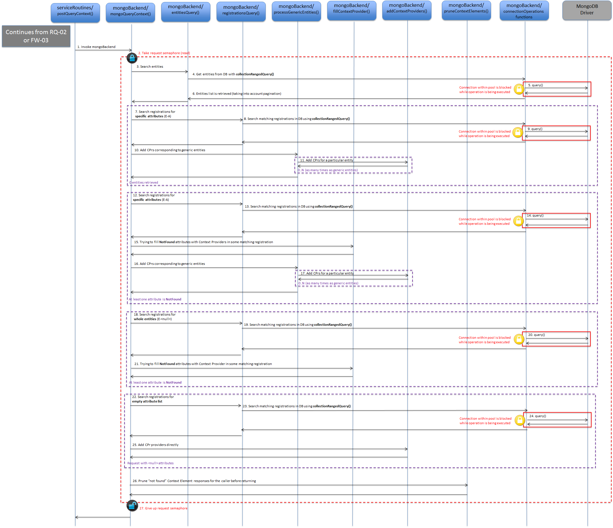

_MB-07: mongoQueryContext_

* `mongoQueryContext()` is invoked from a service routine (step 1).
* Depending on `-reqMutexPolicy`, the request semaphore may be taken (read mode) (step 2). See [this document for details](semaphores.md#mongo-request-semaphore).
* The execution flow passes to `entitiesQuery()` in the `MongoGlobal` module (step 3).
* `entitiesQuery()` basically searches for entities in the database (`entities` collection, [described as part of the database model in the administration documentation](../admin/database_model.md#entities-collection)). More information on this function can be found in the `MongoGlobal` module section. It relies on `collectionRangedQuery()` in the `connectionOperations` module in order to do the actual query in the database (steps 4, 5 and 6). After the query in the database, a part of the function annotates results in order to help in the Context Providers search done by the calling function, using the `found` attribute flag (see details in the source code). The result is then provided in a `ContextElementResponseVector` object, as output parameters.
* Steps 7 to 11 are related to context providers lookup and done only in the case no entity was found in the database.  
   * A lookup for matching registrations based on specific attributes (i.e. in the form "E-A") is done, calling `registrationsQuery()` in the `MongoGlobal` module (step 7). This function searches the database using `collectionRangedQuery()` in the `connectionOperations` module (steps 8 and 9).
   * `processGenericEntities()` is called in order to add context providers corresponding to generic entities (step 10).
   * A loop over generic entities is implemented to add context provider for each such entity, using `addContextProviders()` (step 11).
* Steps 12 to 17 are done only if at least one attribute has the `found` flag set to `false`.
   * A lookup for matching registrations based on specific attributes (i.e. in the form "E-A") is done, calling `registrationsQuery()` in the `MongoGlobal` module (step 12). This function searches the database using `collectionRangedQuery()` in the `connectionOperations` module (steps 13 and 14).
   * After that, `fillContextProviders()` (in the `MongoGlobal` module) is called to attempt to fill the not found attributes with the matched registrations (step 15).
   * `processGenericEntities()` is called to add context providers corresponding to generic entities (step 16).
   * A loop on generic entities is implemented to add context provider for each such entity, by calling `addContextProviders()` (step 17). 
* Steps 18 to 21 are done only if at least one attribute still has the `found` flag set to `false`.
   * A lookup for matching registrations based on whole entities (i.e. in the form "E-&lt;null&gt;") is done, calling `registrationsQuery()` in the `MongoGlobal` module (step 18). This function searches the database using `collectionRangedQuery()` in the `connectionOperations` module (steps 19 and 20).
   * After that, `fillContextProviders()` (in the `MongoGlobal` module) is called to attempt to fill the not found attributes with the matched registrations (step 21).
* Steps 22 to 25 are done only in case the request contains a null list of attributes, i.e. querying for the whole entity.
   * A lookup for matching registrations with empty attribute list is done, calling `registrationsQuery()` in the `MongoGlobal` module (step 22). This function searches the database using `collectionRangedQuery()` in the `connectionOperations` module (steps 23 and 24).
   * Context providers are added directly, by `addContextProviders()` (step 25).
* A "pruning" step is done in order to remove not found elements (i.e. no result from either the local database nor from any context provider). This is done by `pruneContextElements()` in the `MongoGlobal` module (step 26).
* If the request semaphore was taken in step 2, then it is released before returning (step 27). 

By *generic entities* above we mean one of the following:

1. Entities with regular id (i.e. not a pattern) and null type
2. Entities with patterned id and not null type
3. Entities with patterned id and null type

[Top](#top)

#### `mongoQueryTypes` (SR and SR2)

`mongoQueryTypes` encapsulates the logic for the different operations in the NGSIv1 and NGSIv2 APIs that allow type browsing.

The header file contains three functions:

* `mongoEntityTypes()` (SR and SR2): it serves the `GET /v1/contextTypes` and `GET /v2/types` (without `options=values`) operations.
* `mongoEntityTypesValues()` (SR2): it serves the `GET /v2/types?options=values` operation.
* `mongoAttributesForEntityType()` (SR and SR2): it serves the `GET /v1/contextTypes/{type}` and `GET /v2/types/{type}` operations.

The detail for `mongoEntityTypes()` is as shown in the following diagram.

<a name="flow-mb-08"></a>
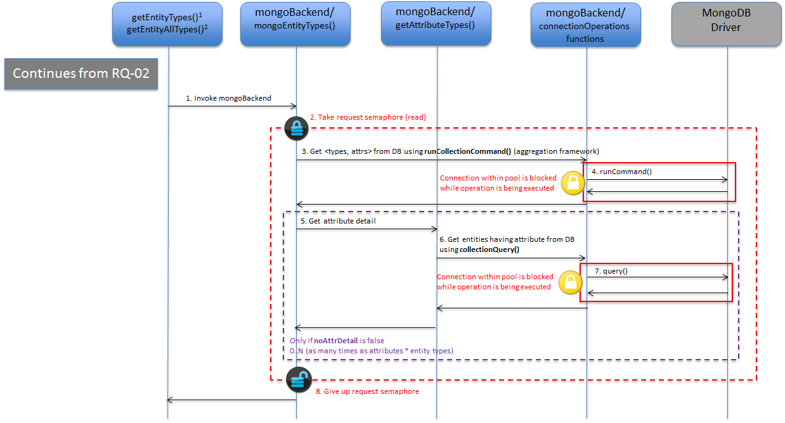

_MB-08: mongoEntityTypes_

* `mongoEntityTypes()` is invoked from a service routine (step 1). This can be from either `getEntityTypes()` (which resides in `lib/serviceRoutines/getEntityTypes.cpp`) or `getEntityAllTypes()` (which resides in `lib/serviceRoutinesV2/getEntityAllTypes.cpp`).
* Depending on `-reqMutexPolicy`, the request semaphore may be taken (read mode) (step 2). See [this document for details](semaphores.md#mongo-request-semaphore). 
* A list of entity types and of attributes belonging to each of those entity types is retrieved from the database, using `runCollectionCommand()` in the `connectionOperations` module, to run an aggregation command (steps 3 and 4).
* If attribute detail is enabled (i.e. `noAttrDetail` set to `false`) a loop iterates on every attribute of every entity type, in order to:
   * Invoke `getAttributeTypes()` to get the different types of the attributes (along with the entities of the same entity type) (step 5).
   * The information is retrieved from the database using `collectionQuery()` in the `connectionsOperation` module (steps 6 and 7).
* If the request semaphore was taken in step 2, then it is released before returning (step 8). 

The detail for `mongoEntityTypesValues()` is as shown in the following diagram.

<a name="flow-mb-09"></a>


_MB-09: mongoEntityTypesValues_

* `mongoEntityTypesValues()` is invoked from a service routine (step 1)
* Depending on `-reqMutexPolicy`, the request semaphore may be taken (read mode) (step 2). See [this document for details](semaphores.md#mongo-request-semaphore).
* A list of entity types is retrieved from the database, using `runCollectionCommand()` in the `connectionOperations` module to run an aggregation command (steps 3 and 4).
* If the request semaphore was taken in step 2, then it is released before returning (step 5). 

The detail for `mongoAttributesForEntityType()` is as shown in the following diagram.

<a name="flow-mb-10"></a>


_MB-10: mongoAttributesForEntityType_

* `mongoAttributesForEntityType()` is invoked from a service routine (step 1). This can be from either `getEntityType()` (which resides in `lib/serviceRoutinesV2/getEntityType.cpp`) or `getAttributesForEntityType()` (which resides in `lib/serviceRoutines/getAttributesForEntityType.cpp`).
* Depending on `-reqMutexPolicy`, the request semaphore may be taken (read mode) (step 2). See [this document for details](semaphores.md#mongo-request-semaphore). 
* A list of entity attributes corresponding to the entity type is retrieved from the database, using `runCollectionCommand()` in the `connectionOperations` module to run an aggregation command (steps 3 and 4).
* If attribute detail is enabled (i.e. `noAttrDetail` set to `false`) a loop iterates on every attribute in order to:
   * Invoke `getAttributeTypes()` to get the different types of the attributes (along with the entities of the same entity type) (step 5).
   * The information is retrieved from the database using `collectionQuery()` in the `connectionsOperation` module (steps 6 and 7).
* If the request semaphore was taken in step 2, then it is released before returning (step 8).

These functions use `EntityTypeVectorResponse` (two first cases) and `EntityTypeResponse` objects in order to return results to calling service routine.

Note the usage of the `noAttrDetails` parameter in `mongoEntityTypes()` and `mongoAttributesForEntityType()` in order to avoid a (potentially costly) process to get types of the attributes associated to an entity type (implemented by `getAttributeTypes()`).

All the above functions heavily rely on the MongoDB aggregation framework. You should be familiar with this framework (and with the `entities` collection structure, [described as part of the database model in the administration documentation](../admin/database_model.md#entities-collection)) in order to understand how the functions work.

[Top](#top)

#### `mongoCreateSubscription` (SR2)

`mongoCreateSubscription` encapsulates the context subscription creation logic.

The header file contains only the function `mongoCreateSubscription()` whose work is basically to get the information from a `Subscription` object and insert the corresponding document in the `csubs` collection in the database ([described as part of the database model in the administration documentation](../admin/database_model.md#csubs-collection)). The new subscription is also inserted in the subscription cache (if the cache is enabled).

<a name="flow-mb-11"></a>
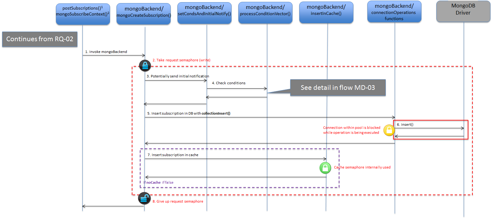

_MB-11: mongoCreateSubscription_

* `mongoCreateSubscription()` is invoked from a service routine (step 1). This can be from either `postSubscriptions()` (which resides in `lib/serviceRoutinesV2/postSubscriptions.cpp`) or `mongoSubscribeContext()` (which resides in `lib/mongoBackend/mongoSubscribeContext.cpp`).
* Depending on `-reqMutexPolicy`, the request semaphore may be taken (write mode) (step 2). See [this document for details](semaphores.md#mongo-request-semaphore).  
* This function builds a BSON object that will be at the end the one to be persisted in the database, using different `set*()` functions (`setExpiration()`, `setHttpInfo()`, etc.). One of these functions, namely `setCondsAndInitialNotify()`, has the side effect of potentially sending initial notifications corresponding to the subscription being created (called in step 3).
* `processConditionVector()` is called to actually send notifications (step 4), whose details are described as part of the `MongoGlobal` module section (see diagram [MD-03](#flow-md-03)).
* The BSON object corresponding to the new subscription is inserted in the database using `collectionInsert()` in the `connectionOperations` module (steps 5 and 6).
* If the subscription cache is enabled  (i.e. `noCache` set to `false`), the new subscription is inserted in the subscription cache (step 7). `insertInCache()` uses the subscription cache semaphore internally (see [this document for details](semaphores.md#subscription-cache-semaphore)).
* If the request semaphore was taken in step 2, then it is released before returning (step 8). 

Note that potential notifications are sent before inserting the subscription in the database/cache, so the correct information regarding last notification times and count is taken into account.

[Top](#top)

#### `mongoUpdateSubscription` (SR2)

`mongoUpdateSubscription` encapsulates the context subscription update logic.

The header file contains only a function named `mongoUpdateSubscription()` whose work is basically to get the information from a `mongoUpdateSubscription` object and use it to update the corresponding document of the `csubs` collection in the database ([described as part of the database model in the administration documentation](../admin/database_model.md#csubs-collection)). The subscription is also updated in the subscription cache (if the subscription cache is enabled).

<a name="flow-mb-12"></a>
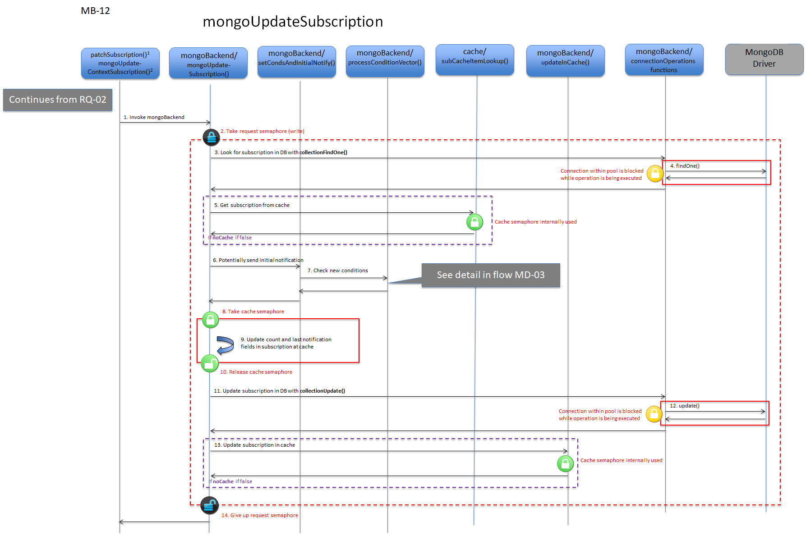

_MB-12: mongoUpdateSubscription_

* `mongoUpdateSubscription()` is invoked from a service routine (step 1). This can be from either `patchSubscription()` (which resides in `lib/serviceRoutinesV2/patchSubscription.cpp`) or `mongoUpdateContextSubscription()` (which resides in `lib/mongoBackend/mongoUpdateContextSubscription.cpp`).
* Depending on `-reqMutexPolicy`, the request semaphore may be taken (write mode) (step 2). See [this document for details](semaphores.md#mongo-request-semaphore). 
* The subscription to be updated is retrieved from the database using `collectionFindOne()` in the `connectionOperations` module (steps 3 and 4).
* If the subscription cache is enabled (i.e. `noCache` set to `false`) the subscription cache object is also retrieved from the subscription cache using `subCacheItemLoopkup()` in the `cache` module (step 5). This should be protected by the subscription cache semaphore, but currently it isn't (see [this issue](https://github.com/telefonicaid/fiware-orion/issues/2882) for details).
* The BSON object of the final subscription is built, based on the BSON object of the original subscription, using different `set*()` functions similar to the ones in the create subscription case (`setExpiration()`, `setHttpInfo()`, etc.). One of these functions, namely `setCondsAndInitialNotify()`, has the "side effect" of potentially sending initial notifications corresponding to the subscription being updated (called in step 6).
* This function in sequence uses `processConditionVector()` to actually send notifications (step 7), whose details are described as part of the `MongoGlobal` module section (see diagram [MD-03](#flow-md-03)).
* The `update`, `count`. and `lastNotification` fields are updated in the subscription cache (step 9). This operation is protected by the subscription cache semaphore (see [this document for details](semaphores.md#subscription-cache-semaphore)) which is taken and released in steps 8 and 10 receptively.
* The BSON object corresponding to the updated subscription is updated in the database using `collectionUpdate()` in the `connectionOperations` module (steps 11 and 12).
* In case the subscription cache is enabled  (i.e. `noCache` set to `false`) the new subscription is updated in the subscription cache (step 13). `updatetInCache()` uses the subscription cache semaphore internally.
* If the request semaphore was taken in step 2, then it is released before returning (step 14). 

Note that potential notifications are sent before updating the subscription in the database/cache, so the correct information regarding last notification times and count is taken into account.

[Top](#top)

#### `mongoGetSubscriptions` (SR2)

`mongoGetSubscriptions` encapsulates the logic for getting subscriptions.

The header file contains two functions:

* `mongoGetSubscription()`, to get individual subscriptions by id, and
* `mongoListSubscriptions()`, to get all subscriptions.

They both return a `Subscription` object (or a vector of `Subscription` objects, in the case of get all) with the result.

In both cases, the implementation is based on a query on the `csubs` collection, ([described as part of the database model in the administration documentation](../admin/database_model.md#csubs-collection)).

Regarding `mongoGetSubscription()`:

<a name="flow-mb-13"></a>


_MB-13: mongoGetSubscription_

* `mongoGetSubscription()` is invoked from a service routine (step 1).
* Depending on `-reqMutexPolicy`, the request semaphore may be taken (read mode) (step 2). See [this document for details](semaphores.md#mongo-request-semaphore). 
* The subscription is retrieved from the database using `collectionQuery()` in the `connectionOperations` module (steps 3 and 4).
* Several `set*()` functions are used in order to fill the `Subscription` object to return. Among them (details in source code) we would like to highlight `setNotification()` (step 5), as it uses the subscription cache semaphore internally (see [this document for details](semaphores.md#subscription-cache-semaphore)).
* If the request semaphore was taken in step 2, then it is released before returning (step 6). 

Regarding `mongoListSubscriptions()`:

<a name="flow-mb-14"></a>


_MB-14: mongoListSubscriptions_

* `mongoListSubscriptions()` is invoked from a service routine (step 1).
* Depending on `-reqMutexPolicy`, the request semaphore may be taken (read mode) (step 2). See [this document for details](semaphores.md#mongo-request-semaphore). 
* The subscription is retrieved from the database using `collectionRangedQuery()` in the `connectionOperations` module (steps 3 and 4).
* For each subscription to return, several `set*()` functions are used in order to fill the `Subscription` objects. Among them (details in source code) we would like to highlight `setNotification()` (step 5), as it uses the subscription cache semaphore internally (see [this document for details](semaphores.md#subscription-cache-semaphore)). 
* If the request semaphore was taken in step 2, then it is released before returning (step 6). 

[Top](#top)

#### `mongoUnsubscribeContext` (SR and SR2)

`mongoUnsubscribeContext` encapsulates the logic for unsubscribe context operation (NGSIv1) and remove subscription (NGSIv2).

The header file contains only the function `mongoUnsubscribeContext()` which uses an `UnsubscribeContextRequest` object as input parameter and an `UnsubscribeContextResponse` as output parameter.

Its work is to remove from the database the document associated to the subscription in the `csubs` collection. The subscription is also removed from the cache (if cache is enabled).

<a name="flow-mb-15"></a>


_MB-15: mongoUnsubscribeContext_

* `mongoUnsubscribeContext()` is invoked from a service routine (step 1). This can be from either `postUnsubscribeContext()` (which resides in `lib/serviceRoutines/postUnsubscribeContext.cpp`) or `mongoUpdateContextSubscription()` (which resides in `lib/serviceRoutinesV2/deleteSubscription.cpp`).
* Depending on `-reqMutexPolicy`, the request semaphore may be taken (write mode) (step 2). See [this document for details](semaphores.md#mongo-request-semaphore).
* The subscription is retrieved from the database using `collectionFindOne()` in the `connectionOperations` module (steps 3 and 4).
* The subscription is removed from the database using `collectionRemove()` in the `connectionOperations` module (steps 5 and 6).
* The subscription is also deleted from the subscription cache (steps 8 and 9). Cache access is protected by the subscription cache semaphore (see [this document for details](semaphores.md#subscription-cache-semaphore)), which is taken and released in steps 7 and 10 respectively.
* If the request semaphore was taken in step 2, then it is released before returning (step 11). 

Note that steps 6 and 7 are done no matter the value of `noCache`. This works but it is inefficient. It should be fixed ([an issue](https://github.com/telefonicaid/fiware-orion/issues/2879) has been created about it).

[Top](#top)

#### `mongoSubscribeContext` (SR)

`mongoSubscribeContext` encapsulates the logic for subscribe context (NGSIv1) operation.

The header file contains only a function named `mongoSubscribeContext()` which uses a `SubscribeContextRequest` object as input parameter and a `SubscribeContextResponse` as output parameter.

Actually, this function is a wrapper of the NGSIv2 version of this operation, i.e. `mongoCreateSubscription()` in the [mongoCreateSubscription module](#mongocreatesubscription-sr2).

<a name="flow-mb-16"></a>


_MB-16: mongoSubscribeContext_

* `mongoSubscribeContext()` is invoked from a service routine (step 1).
* The execution flow is passed to `mongoCreateSubscription()` (step 2). See diagram [MB-11](#flow-mb-11).

[Top](#top)

#### `mongoUpdateContextSubscription` (SR)

`mongoUpdateContextSubscription` encapsulates the logic for update context subscription (NGSIv1) operation.

The header file contains only a function named `mongoUpdateContextSubscription()` which uses an `UpdateContextSubscriptionRequest` object as input parameter and an `UpdateContextSubscriptionResponse` as output parameter.

Actually, this function is a wrapper of the NGSIv2 version of this operation, i.e. `mongoUpdateSubscription()` in the [mongoUpdateSubscription module](#mongoupdatesubscription-sr2).

<a name="flow-mb-17"></a>


_MB-17: mongoUpdateContextSubscription_

* `mongoUpdateContextSubscription()` is invoked from a service routine (step 1).
* The execution flow is passed to `mongoUpdateSubscription()` (setp 2). See diagram [MB-12](#flow-mb-12).

[Top](#top)

#### `mongoRegisterContext` (SR) and `mongoNotifyContextAvailability` (SR) 

The `mongoRegisterContext` module provides the entry point for the register context operation processing logic (by means of `mongoRegisterContext()` defined in its header file) while the `mongoNotifyContextAvailability` module provides the entry point for the context availability notification processing logic (by means of `mongoNotifyContextAvailability()` in its header file). However, given that a context availability notification is processed in the same way as a register context, both `mongoRegisterContext()` and `mongoNotifyContextAvailability()` are at the end basically wrappers for `processRegisterContext()` (single external function in the `MongoCommonRegister` module), which does the work consisting in creating a new registration or updating an existing one in the `registrations` collection in the database ([described as part of the database model in the administration documentation](../admin/database_model.md#registrations-collection)).

<a name="flow-mb-18"></a>
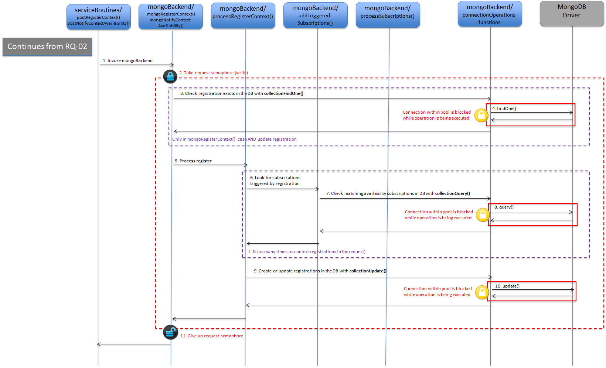

_MB-18: mongoRegisterContext_

* `mongoRegisterContext()` or `mongoNotifyContextAvailability` is invoked from a service routine (step 1).
* Depending on `-reqMutexPolicy`, the request semaphore may be taken (write mode) (step 2). See [this document for details](semaphores.md#mongo-request-semaphore). 
* In the case of `mongoRegisterContext()` if a registration id was provided in the request, it indicates a registration *update*. Thus, the `registrations` document is retrieved from the database using `collectionFindOne()` in the `connectionOperations` module (steps 3 and 4).
* `processRegisterContext()` is called to process the registration (step 5).
* For each registration in the request, `addTriggeredSubscriptions()` is called (step 6). This function in sequence uses `collectionQuery()` in the `connectionOperations` module in order to check whether the registration triggers a subscription or not (steps 7 and 8). The `subsToNotify` map is used to store the triggered subscriptions.
* The `registration` document is created or updated in the database. In order to do so, `collectionUpdate()` in the `connectionOperations` module is used, setting the `upsert` parameter to `true` (steps 9 and 10).
* `processSubscriptions()` is called in order to process triggered subscriptions (step 11). The `subsToNotify` map is iterated over in order to process each one individually, by `processAvailabilitySubscription()` (step 12). This process is described in the [diagram MD-04](#flow-md-04).
* If the request semaphore was taken in step 2, then it is released before returning (step 13).  

[Top](#top)

#### `mongoDiscoverContextAvailability` (SR)

`mongoDiscoverContextAvailability` encapsulates the logic for the context availability discovery (NGSIv1) operation.

The header file contains only a function named `mongoDiscoverContextAvailability()` which uses a `DiscoverContextAvailabilityRequest` object as input parameter and a `DiscoverContextAvailabilityResponse` as output parameter. Its work is to build a response object based on the input request object and the registration existing in the database.

<a name="flow-mb-19"></a>
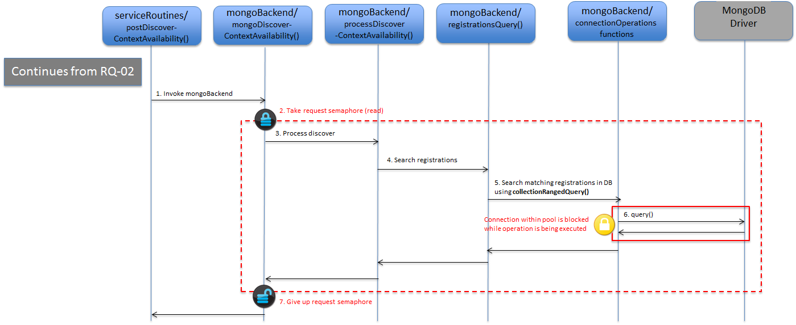

_MB-19: mongoDiscoverContextAvailability_

* `mongoDiscoverContextAvailability()` is invoked from service routine (step 1)
* Depending on `-reqMutexPolicy`, the request semaphore may be taken (read mode) (step 2). See [this document for details](semaphores.md#mongo-request-semaphore). 
* Execution flow passes to `processDiscoverContextAvailability()` (step 3)
* Registration search is done using `registrationQuery()` (steps 4). This function in sequence uses `collectionRangedQuery()` in order to retrieve registrations from the database (steps 5 and 6).
* If the request semaphore was taken in step 2, then it is released before returning (step 7).  

[Top](#top)

#### `mongoSubscribeContextAvailability` (SR)

`mongoSubscribeContextAvailability` encapsulates the context availability subscription creation logic.

The header file contains only a function named `mongoSubscribeContextAvailability()` which uses a `SubscribeContextAvailabilityRequest` object as input parameter and a `SubscribeContextAvailabilityResponse` as output parameter. Its work is to create a new context availability subscription in the `casubs` collection in the database ([described as part of the database model in the administration documentation](../admin/database_model.md#casubs-collection)).

<a name="flow-mb-20"></a>
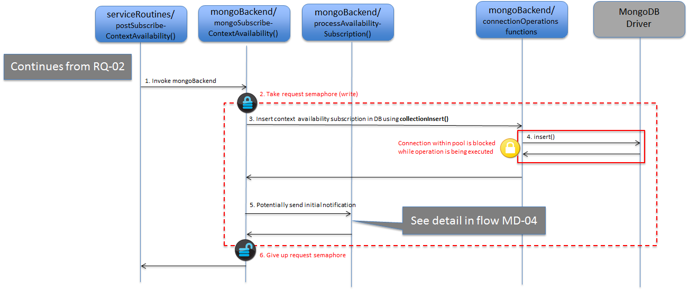

_MB-20: mongoSubscribeContextAvailability_

* `mongoSubscribeContextAvailability()` is invoked from a service routine (step 1).
* Depending on `-reqMutexPolicy`, the request semaphore may be taken (write mode) (step 2). See [this document for details](semaphores.md#mongo-request-semaphore). 
* The context availability subscription document is created in the database. In order to do so, `collectionInsert()` in the `connectionOperations` module is used (steps 3 and 4).
* Notifications may be triggered as a result of this creation. This is done by `processAvailabilitySubscription()` (step 5), which is described in diagram [MD-04](sourceCode.md#flow-md-04).
* If the request semaphore was taken in step 2, then it is released before returning (step 6). 

[Top](#top)

#### `mongoUpdateContextAvailabilitySubscription` (SR)

`mongoUpdateContextAvailabilitySubscription` encapsulates the update context availability subscription operation logic.

The header file contains only a function named `mongoUpdateContextAvailabilitySubscription()` which uses an `UpdateContextAvailabilitySubscriptionRequest` object as input parameter and an `UpdateContextAvailabilitySubscriptionResponse` as output parameter. Its work is to update the corresponding context availability subscription in the `casubs` collection in the database ([described as part of the database model in the administration documentation](../admin/database_model.md#casubs-collection)).

<a name="flow-mb-21"></a>
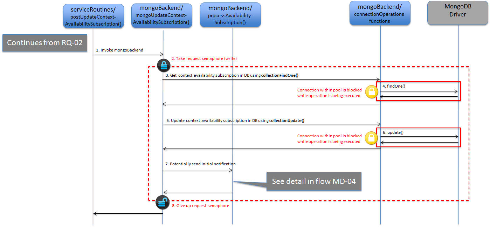

_MB-21: mongoUpdateContextAvailabilitySubscription_

* `mongoUpdateContextAvailabilitySubscription()` is invoked from a service routine (step 1).
* Depending on `-reqMutexPolicy`, the request semaphore may be taken (write mode) (step 2). See [this document for details](semaphores.md#mongo-request-semaphore). 
* The context availability subscription document to update is retrieved from the database, by the means of `collectionFindOne()` in the `connectionOperations` module (steps 3 and 4).
* The context availability subscription document is updated in the database. In order to do so, `collectionUpdate()` in the `connectionOperations` module is used (steps 5 and 6).
* Notifications may be triggered as a result of this update. This is done by `processAvailabilitySubscription()` (step 7), which is described in diagram [MD-04](#flow-md-04).
* If the request semaphore was taken in step 2, then it is released before returning (step 8). 

[Top](#top)

#### `mongoUnsubscribeContextAvailability` (SR)

`mongoUnsubscribeContextAvailability` encapsulates the logic for unsubscribe context availability operation.

The header file contains only a function named `mongoUnsubscribeContextAvailability()` which uses an `UnsubscribeContextAvailabilityRequest` object as input parameter and an `UnsubscribeContextAvailabilityResponse` as output parameter.

Its work is to remove from the database the document associated to the subscription in the `casubs` collection.

<a name="flow-mb-22"></a>


_MB-21: mongoUnsubscribeContextAvailability_

* `mongoUnsubscribeContextAvailability()` is invoked from a service routine (step 1).
* Depending on `-reqMutexPolicy`, the request semaphore may be taken (write mode) (step 2). See [this document for details](semaphores.md#mongo-request-semaphore). 
* The subscription is retrieved from the database using `collectionFindOne()` in the `connectionOperations` module (steps 3 and 4).
* The subscription is removed from the database using `collectionRemove()` in the `connectionOperations` module (steps 5 and 6).
* If the request semaphore was taken in step 2, then it is released before returning (step 7). 

[Top](#top)

#### `mongoRegistrationGet` (SR2)

`mongoRegistrationGet` encapsulates the logic for getting context registrations for NGSIv2 API.

The header file contains two functions:

* `mongoRegistrationGet()`, to get individual context registrations by id, and
* `mongoRegistrationsGet()`, to get all context registrations.

They both return a `Registration` object (or a vector of `Registration` objects, in the case of get all) with the result.

In both cases, the implementation is based on a query on the `registrations` collection, ([described as part of the database model in the administration documentation](../admin/database_model.md#registrations-collection)).

Regarding `mongoRegistrationGet()`:

<a name="flow-mb-23"></a>
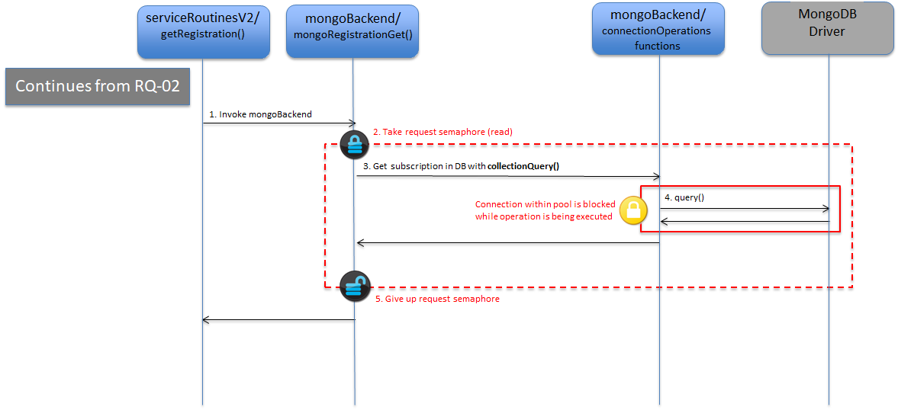

_MB-13: mongoRegistrationGet_

* `mongoRegistrationGet()` is invoked from a service routine (step 1).
* Depending on `-reqMutexPolicy`, the request semaphore may be taken (read mode) (step 2). See [this document for details](semaphores.md#mongo-request-semaphore). 
* The registration is retrieved from the database using `collectionQuery()` in the `connectionOperations` module (steps 3 and 4).
* Several `set*()` functions are used in order to fill the `Registration` object to return.
* If the request semaphore was taken in step 2, then it is released before returning (step 5). 

Regarding `mongoRegistrationsGet()`:

<a name="flow-mb-24"></a>
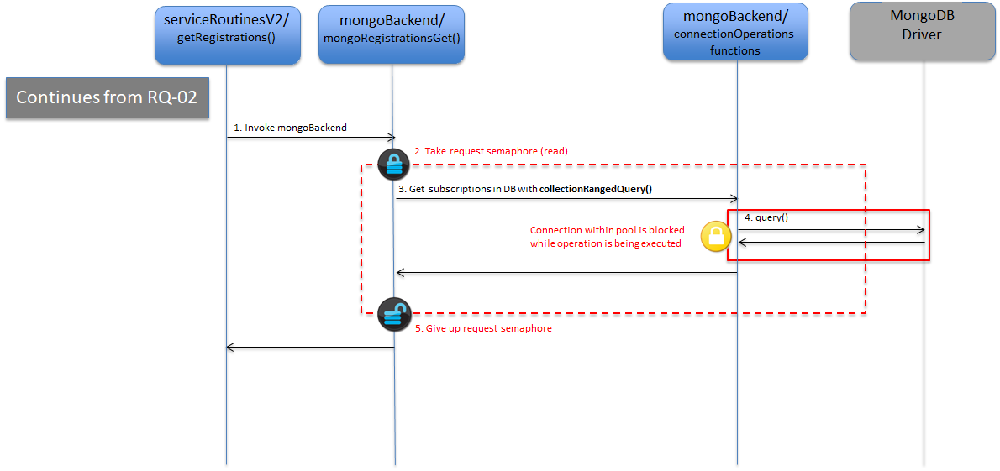

_MB-14: mongoRegistrationsGet_

* `mongoRegistrationsGet()` is invoked from a service routine (step 1).
* Depending on `-reqMutexPolicy`, the request semaphore may be taken (read mode) (step 2). See [this document for details](semaphores.md#mongo-request-semaphore). 
* The subscription is retrieved from the database using `collectionRangedQuery()` in the `connectionOperations` module (steps 3 and 4).
* For each subscription to return, several `set*()` functions are used in order to fill the `Registration` objects. 
* If the request semaphore was taken in step 2, then it is released before returning (step 6). 

[Top](#top)

#### `mongoRegistrationCreate` (SR2)

`mongoRegistrationCreate` encapsulates the context registration creation logic for NGSIv2 API.

The header file contains only the function `mongoRegistrationCreate()` whose work is basically to get the information from a `Registration` object and insert the corresponding document in the `registrations` collection in the database ([described as part of the database model in the administration documentation](../admin/database_model.md#registrations-collection)).

<a name="flow-mb-25"></a>


_MB-25: mongoRegistrationCreate_

* `mongoRegistrationCreate()` is invoked from a `postRegistrations()` service routine (step 1).
* Depending on `-reqMutexPolicy`, the request semaphore may be taken (write mode) (step 2). See [this document for details](semaphores.md#mongo-request-semaphore).  
* This function builds a BSON object that will be at the end the one to be persisted in the database, using different `set*()` functions (`setExpiration()`, `setRegistrationId()`, etc.). The BSON object corresponding to the new registration is inserted in the database using `collectionInsert()` in the `connectionOperations` module (steps 3 and 4).
* If the request semaphore was taken in step 2, then it is released before returning (step 5). 

[Top](#top)

### Connection pool management

The module `mongoConnectionPool` manages the database connection pool. How the pool works is important and deserves an explanation. Basically, Orion Context Broker keeps a list of connections to the database (the `connectionPool` defined in `mongoConnectionPool.cpp`). The list is sized with 
`-dbPoolSize` [CLI parameter](../admin/cli.md) (10 by default). Each element in the list is an object of this type:

```
typedef struct MongoConnection
{
  DBClientBase*  connection;
  bool           free;
} MongoConnection;
```

where `connection` is the actual connection (`DBClientBase` is a class in the MongoDB driver) and `free` a flag to know whether the connection is currently in use or not. This is important, as `DBClientBase` objects are not thread safe (see more details in [this post at StackOverflow](http://stackoverflow.com/questions/33945987/thread-safeness-at-mongodb-c-driver-regarding-indirect-connection-usage-throug)) so the Context Broker logic must ensure that the same connections is not being used by two threads at the same time.

Taking this into account, the main functions within the `mongoConnectionPool` module are (there are more than this, but the rest are secondary modules, related to metrics logic):

* `mongoConnectionPoolInit()`: to initialize the pool, called from the Context Broker bootstrapping logic.
* `mongoPoolConnectionGet()`: to get a free connection from the pool
* `mongoPoolConnectionRelease()`: to release a connection, so it returns to the pool and it is ready to be selected again by next call to `mongoConnectionGet()`.

A semaphore system is used to protect connection usage. Have a look at [this separate document](semaphores.md#mongo-connection-pool-semaphores) for details.

[Top](#top)

### Low-level modules related to database interaction

* `connectionOperations`: a wrapper for database operations (such as insert, find, update, etc.), adding Orion specific aspects (e.g. concurrency management in the database connection pool, error handling, logging, etc.). MongoDB driver methods to interact with the database should not be used directly, but using this module (or expand it if you need an operation that is not covered).
* `safeMongo`: safe methods to get fields from BSON objects. Direct access to BSON objects using MongoDB driver methods should be avoided, use `safeMongo` module instead (or expand it if you need another way of accessing BSON information that is not covered).
* `dbConstants` (only `.h`): field names used at database level (the same as described [in the database model documentation](../admin/database_model.md)) are defined here. 
* `dbFieldsEncoding` (only `.h`): inline helper functions to do encoding at database level and metadata string splitting.

[Top](#top)

### Specific purpose modules

* `MongoCommonSubscription`: common functions used by several other modules related to the subscription logic. Most of the functions of this module are set-functions to fill fields in `Subscriptions` objects.
* `location`: functions related to location management in the database.
* `mongoSubCache`: functions used by the [cache](sourceCode.md#srclibcache) library to interact with the database.
* `compoundResponses` and `compoundValueBson`: modules that help in the conversion between BSON data and internal types (mainly in the [ngsi](sourceCode.md#srclibngsi) library) and viceversa.
* `TriggeredSubscription`: helper class used by subscription logic (both context and context availability subscriptions) in order to encapsulate the information related to triggered subscriptions on context or registration creation/update.
 
[Top](#top)

### The `MongoGlobal` module

Finally we have the `MongoGlobal` module, which contains a set of helper functions, used by other **mongoBackend** modules or even other libraries. It contains around 40 individual functions so it doesn't make sense to provide all the details in the present document. However, we will highlight the most important ones.

[Top](#top)

#### `mongoInit()`

`mongoInit()` is used by CB initialization logic (in [`contextBroker.cpp` `main()`](sourceCode.md#srcappcontextbroker)) to initialize the database connection pool.

[Top](#top)

#### `entitiesQuery()`

This function basically searches for entities in the database (`entities` collection, [described as part of the database model in the administration documentation](../admin/database_model.md#entities-collection)). It takes into account service (also named "tenant"), service path, pagination and sorting parameters. The query for MongoDB is composed of several parts: entities, service path, attributes and scopes (filters and geo-location).  

`entitiesQuery()` relies on `collectionRangedQuery()` in the `connectionOperations` module in order to do the actual query in the database. After the query in the database, a part of the function annotates results in order to help in the Context Providers search done by the calling function, using the `found` attribute flag (see details in the source code). The result is then saved in a `ContextElementResponseVector` object, as output parameters.

The function is called from the following places:

* `mongoQueryContext()` (in the `mongoQuery` module), as the "core" of the query operation.
* `processOnChangeConditionForSubscription()`, to search the entities to "fill" initial notifications during context subscription creation/update.

[Top](#top)

#### `registrationsQuery()` 

This function basically searches for existing registrations in the (`registrations` collection, [described as part of the database model in the administration documentation](../admin/database_model.md#registrations-collection)) of the database. It takes into account service (also named "tenant"), service path and pagination parameters. 

It is used by several functions:

* `mongoDiscoverContextAvailability()` (in the `mongoDiscoverContextAvailability` module), as "core" of the discovery operation.
* `processAvailabilitySubscription()` (also part of the `MongoGlobal` module) in order to detect registrations that triggers context availability notifications.
* `mongoQueryContext()` in the `mongoQueryContext` module, in order to locate Context Providers for forwarding of the query. Note that the forwarding is not done within the **mongoBackend** library, but from the calling **serviceRoutine**.
* `searchContextProviders()` in the `MongoCommonUpdate` module, in order to locate Context Providers for forwarding of the update. Note that the forwarding is not done within the **mongoBackend** library, but from the calling **serviceRoutine**.

[Top](#top)

#### `processConditionVector()`

This function is called during context subscription creation/update and possibly sends an initial notification associated to the subscription.

<a name="flow-md-03"></a>


_MD-03: `processConditionVector()` function detail_

* `processConditionVector()` (step 1) is invoked by mongoBackend functions. See diagrams [MB-11](#flow-mb-11) and [MB-12](#flow-mb-12).
* A loop iterates over each individual condition in the `NotifyConditionVector` vector (although most of the times this vector has only one item):
   * `processOnChangeConditionForSubscription()` is called to process the individual condition (step 2).
   * `entitiesQuery()` is called to get the entities to be included in the notification (step 3), which in sequence relies on `collectionRangedQuery()` in the `connectionOperations` module in order to get the entities from the database (steps 4 and 5).
   * `pruneContextElements()` is called in order to remove not found elements, as it makes no sense including them in the notification (step 6).
   * If, after pruning, there is any entity to send, steps 7 to 11 are executed.
	   * In the case of conditions for particular attributes (i.e. not empty condition), a second lookup is done using `entitiesQuery()` (steps 7, 8 and 9, plus pruning in step 10).
	   * Notifications are sent (step 11) using the `Notifier` object (from [ngsiNotify](sourceCode.md#srclibngsinotify) library) in order to actually send the notification (step 3). The detail is provided in diagrams [NF-01](sourceCode.md#flow-nf-01) or [NF-03](sourceCode.md#flow-nf-03). In the case of conditions for particular attributes, notifications are sent only if the previous check was ok. In the case of all-attributes notifications (i.e. empty condition) notifications are always sent.

Note that `processOnChangeConditionForSubscription()` has a "sibling" function named `processOnChangeConditionForUpdateContext()` for non-initial notifications (see diagram [MD-01](#flow-md-01)).

[Top](#top)

#### `processAvailabilitySubscription()`

Similar to  `processOnChangeConditionForSubscription()` and   `processOnChangeConditionForUpdateContext()` this function is the one that effectively composes context availability notifications.

It is called from:
* Context availability creation/update logic, so an initial notification for all matching context registrations is sent.
* Register operation logic, when a new (or updated) context registration matches an availability subscription.

<a name="flow-md-04"></a>


_MD-04: `processAvailabilitySubscription()` function detail_

* `processAvailabilitySubscription()` is invoked (step 1). See diagrams [MB-18](#flow-mb-18), [MB-20](#flow-mb-20) and [MB-21](#flow-mb-21).
* Check if any registration matches the subscription, using `registrationsQuery()` (step 2). This function uses `collectionRangeQuery()` in the `connectionOperations` module to check in the database (steps 3 and 4).
* In case any registration matches, the process continues. Availability notifications are sent (step 5) using a `Notifier` object (from [ngsiNotify](sourceCode.md#srclibngsinotify) library). Details on this are found in diagram [NF-02](sourceCode.md#flow-nf-02).
* Finally, last notification and count statistics are updated, by calling `mongoUpdateCasubNewNotification()` (step 6). This function uses `collectionUpdate()` in the `connectionOperations` module to update the corresponding context availability subscription document in the database (steps 7 and 8).

[Top](#top)


